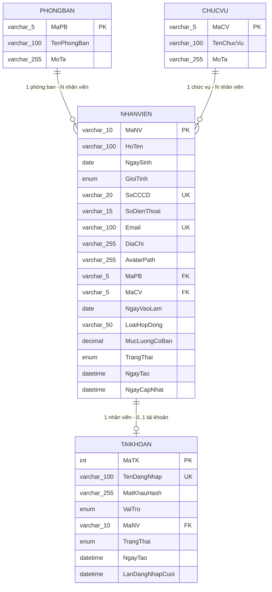

# QLNhanSu — Hệ thống Quản lý Nhân sự (HR Management)

Ứng dụng desktop quản lý nhân sự viết bằng **Java Swing** (giao diện dựng bằng IntelliJ GUI Designer, file `.form` + `.java`), kết nối **MySQL** qua JDBC thuần (không dùng framework/ORM). Toàn bộ thư viện ngoài được thêm thủ công qua IntelliJ Project Structure gồm: ....

## 1. Công nghệ sử dụng

| Thành phần | Công nghệ |
|---|---|
| Ngôn ngữ | Java (Swing) |
| Giao diện | IntelliJ GUI Designer (`.form` + binding sang `.java`) |
| Cơ sở dữ liệu | MySQL (JDBC thuần, `PreparedStatement`) |
| Mã hóa mật khẩu | jBCrypt (`org.mindrot.jbcrypt`, phiên bản đọc hash dạng `$2a$`) |


## 2. Cấu trúc thư mục thực tế

```
Final_1/
├── Data.Basesql.sql                 ← script tạo DB + dữ liệu mẫu (chạy 1 lần trong MySQL)
├── src/
│   ├── QLNhanSu.iml
│   └── src/
│       ├── database/
│       │   ├── DBConnection.java        ← đọc db.properties, mở Connection JDBC
│       │   ├── db.properties            ← url/username/password (KHÔNG commit, xem mục 5)
│       │   ├── db.properties.example    ← file mẫu để tạo db.properties
│       │   └── dao/
│       │       ├── DanhMucDAO.java      ← interface CRUD dùng chung cho Phòng ban/Chức vụ
│       │       ├── PhongBanDAO.java
│       │       ├── ChucVuDAO.java
│       │       ├── NhanVienDAO.java     ← CRUD + tìm kiếm + lọc nâng cao + sinh Mã NV tự động
│       │       └── TaiKhoanDAO.java     ← đăng nhập (BCrypt), tạo/khóa/đổi vai trò tài khoản
│       │
│       ├── model/                       ← POJO ánh xạ các bảng trong DB
│       │   ├── NhanVien.java
│       │   ├── PhongBan.java / ChucVu.java (cùng implement DanhMuc)
│       │   ├── DanhMuc.java             ← interface {getId, getTen, getMoTa}
│       │   ├── TaiKhoan.java
│       │   └── Session.java             ← holder tĩnh giữ tài khoản đang đăng nhập
│       │
│       ├── util/
│       │   ├── ValidationUtil.java      ← validate email, SĐT, CCCD
│       │   ├── DateUtil.java            ← parse/format ngày dd/MM/yyyy ⇄ LocalDate
│       │   ├── TableModelUtil.java      ← đổ List<NhanVien> vào JTable
│       │   └── ActivityLogger.java      ← ghi log sửa/xóa nhân viên ra logs/nhanvien_activity.txt
│       │
│       └── view/
│           ├── Main.java                ← entry point (mở màn Login)
│           ├── Login.java / .form       ← màn đăng nhập
│           ├── MainFrame.java / .form   ← khung chính: sidebar + top bar + CardLayout nội dung
│           └── panels/                  ← các "trang" bên trong MainFrame (không phải JFrame riêng)
│               ├── DashboardPanel.java / .form         ← "Tổng quan"
│               ├── ListEmployeesPanel.java / .form     ← "Quản lý" (danh sách/tìm kiếm/lọc nhân viên)
│               ├── AddEmployeesPanel.java / .form       ← "Thêm/Sửa nhân viên" (dùng chung 1 form)
│               ├── AccountManagementPanel.java (thuần Java, không .form) ← "Phân quyền"
│               └── CategoryManagementPanel.java (thuần Java, không .form) ← "Danh mục" (Phòng ban/Chức vụ)
│
├── avatars/     ← ảnh đại diện nhân viên (sinh ra lúc chạy app, gitignore)
├── logs/        ← nhật ký sửa/xóa nhân viên (sinh ra lúc chạy app, gitignore)
└── out/         ← build output của IntelliJ (gitignore)
```

## 3. Chức năng hiện có

### Đăng nhập & phân quyền
- Đăng nhập bằng **email + mật khẩu**, kiểm tra qua `TaiKhoanDAO.checkLogin()` (so khớp BCrypt, chặn tài khoản bị khóa).
- 2 vai trò: **Admin** và **NhanVien** (nhân viên phòng nhân sự). Không có chức năng tự đăng ký — chỉ Admin tạo tài khoản.
- Admin thấy thêm 2 mục **"Phân quyền"** và **"Danh mục"** ở sidebar; NhanVien không thấy 2 mục này nhưng **vẫn được Sửa/Xóa nhân viên** như Admin.

### Quản lý nhân viên ("Quản lý")
- Liệt kê danh sách nhân viên, phân trang (10 dòng/trang).
- Tìm kiếm nhanh theo tên/SĐT/email/mã NV (ô tìm kiếm ngay trong trang).
- Lọc nâng cao: theo Phòng ban, Chức vụ, Trạng thái, Giới tính (Nam/Nữ/Khác — chỉ chọn 1), có nút "Xóa lọc" để quay lại danh sách đầy đủ.
- Thêm/Sửa/Xóa nhân viên dùng chung 1 form (`AddEmployeesPanel`), có validate (họ tên, ngày sinh, CCCD, SĐT, email, ngày vào làm, lương).
- **Mã nhân viên tự sinh**, không nhập tay: `MãPhòngBan + 3 chữ số` (vd `IT001`, `KD002`), đếm riêng theo từng phòng ban, không bao giờ trùng dù có xóa nhân viên ở giữa.
- Upload ảnh đại diện: copy vào thư mục `avatars/`, lưu đường dẫn tương đối trong DB.
- Mỗi lần Sửa/Xóa nhân viên đều được ghi log (ai làm, làm gì, với ai) vào `logs/nhanvien_activity.txt`.
- Nút "Xuất" hiện có nhưng **chưa triển khai** (TODO, ngoài phạm vi hiện tại).

### Tổng quan (Dashboard)
- Số liệu thật lấy từ DB: tổng số nhân viên, số phòng ban, số nhân viên mới vào trong tháng.
- Thống kê nhân viên theo từng phòng ban (dạng danh sách đơn giản, không dùng biểu đồ).
- Nút "Tải báo cáo" hiện có nhưng **chưa triển khai** (TODO).

### Danh mục (chỉ Admin)
- Quản lý **Phòng ban** và **Chức vụ** dùng chung 1 giao diện (2 tab), CRUD đầy đủ.
- **Mã phòng ban/chức vụ** do người dùng tự đặt: tối đa 5 chữ cái in hoa (A-Z), không cho trùng.
- Xóa có cảnh báo nếu đang có nhân viên thuộc phòng ban/chức vụ đó (xóa vẫn được, nhân viên liên quan sẽ bị bỏ trống phòng ban/chức vụ).

### Phân quyền / Quản lý tài khoản (chỉ Admin)
- Tạo tài khoản mới (username phải đúng định dạng email vì màn Đăng nhập yêu cầu vậy), chọn vai trò Admin/NhanVien.
- Khóa/Mở khóa tài khoản, đổi vai trò — thao tác ngay trên từng dòng trong bảng.
- Không cho tự khóa hoặc tự đổi vai trò của chính tài khoản đang đăng nhập.

## 4. Phân chia công việc nhóm (2 người)

**A47752 - HÀ DUY ANH : Dữ liệu + Nghiệp vụ nhân viên**
- `database/` (DBConnection, toàn bộ `dao/`), toàn bộ `model/`
- `view/Login.java` + `.form` (đăng nhập, BCrypt)
- `view/panels/ListEmployeesPanel` + `AddEmployeesPanel` (CRUD, tìm kiếm, lọc, sinh Mã NV, upload avatar)
- `util/ActivityLogger`, `util/ValidationUtil`, `util/DateUtil`, `util/TableModelUtil`
- `Data.Basesql.sql` (thiết kế schema + dữ liệu mẫu)

**A48595 - NGUYỄN TIẾN PHÚC : Khung ứng dụng + Nghiệp vụ quản trị**
- `view/MainFrame` + `.form` (sidebar, top bar, điều hướng CardLayout, phân quyền hiển thị theo vai trò)
- `view/panels/DashboardPanel` (thống kê tổng quan)
- `view/panels/AccountManagementPanel` (tạo/khóa/đổi vai trò tài khoản)
- `view/panels/CategoryManagementPanel` (CRUD Phòng ban/Chức vụ)
- Thiết kế giao diện `.form` (bố cục, căn chỉnh trong GUI Designer), kiểm thử toàn bộ luồng end-to-end

## 5. Cơ sở dữ liệu (Database Schema)

Database `qlnhansu` gồm **4 bảng**, được tạo bởi [`Data.Basesql.sql`](Data.Basesql.sql). Không dùng ORM — mọi thao tác đọc/ghi đều qua `PreparedStatement` thuần trong các lớp `dao/`.

### Sơ đồ quan hệ (ERD)



### Chi tiết từng bảng

**`PHONGBAN`** — danh mục phòng ban
| Cột | Kiểu | Ghi chú |
|---|---|---|
| `MaPB` | `varchar(5)` PK | Người dùng tự đặt, tối đa 5 chữ in hoa (vd `IT`, `KD`) |
| `TenPhongBan` | `varchar(100)` | `UNIQUE`, không được trùng tên |
| `MoTa` | `varchar(255)` | Tùy chọn |

**`CHUCVU`** — danh mục chức vụ (cấu trúc tương tự `PHONGBAN`)
| Cột | Kiểu | Ghi chú |
|---|---|---|
| `MaCV` | `varchar(5)` PK | Vd `NV`, `TN`, `QL`, `TP`, `GD` |
| `TenChucVu` | `varchar(100)` | `UNIQUE` |
| `MoTa` | `varchar(255)` | Tùy chọn |

**`NHANVIEN`** — hồ sơ nhân viên (bảng trung tâm)
| Cột | Kiểu | Ghi chú |
|---|---|---|
| `MaNV` | `varchar(10)` PK | **Tự sinh**: `MaPB` + 3 chữ số, đếm riêng theo từng phòng ban (vd `IT001`, `KD002`) |
| `HoTen` | `varchar(100)` | Bắt buộc |
| `NgaySinh` | `date` | |
| `GioiTinh` | `enum('Nam','Nữ','Khác')` | Mặc định `Khác` |
| `SoCCCD` | `varchar(20)` | `UNIQUE` |
| `SoDienThoai` | `varchar(15)` | |
| `Email` | `varchar(100)` | `UNIQUE` |
| `DiaChi` | `varchar(255)` | |
| `AvatarPath` | `varchar(255)` | Đường dẫn tương đối tới file trong `avatars/` |
| `MaPB` | `varchar(5)` FK → `PHONGBAN.MaPB` | `ON DELETE SET NULL` — xóa phòng ban thì nhân viên không mất, chỉ bị bỏ trống |
| `MaCV` | `varchar(5)` FK → `CHUCVU.MaCV` | `ON DELETE SET NULL` tương tự |
| `NgayVaoLam` | `date` | |
| `LoaiHopDong` | `varchar(50)` | Vd "Chính thức", "Thử việc", "Thời vụ" |
| `MucLuongCoBan` | `decimal(15,2)` | Mặc định 0 |
| `TrangThai` | `enum('DangLamViec','NghiViec','TamNghi')` | Mặc định `DangLamViec` |
| `NgayTao` / `NgayCapNhat` | `datetime` | Tự động set bởi MySQL (`DEFAULT CURRENT_TIMESTAMP` / `ON UPDATE`) |

Có index trên `HoTen`, `TrangThai`, `GioiTinh` để tăng tốc tìm kiếm/lọc.

**`TAIKHOAN`** — tài khoản đăng nhập + phân quyền
| Cột | Kiểu | Ghi chú |
|---|---|---|
| `MaTK` | `int` PK, `AUTO_INCREMENT` | |
| `TenDangNhap` | `varchar(100)` | `UNIQUE`, phải đúng định dạng email |
| `MatKhauHash` | `varchar(255)` | **Chỉ lưu hash BCrypt** (dạng `$2a$...`), không bao giờ lưu mật khẩu gốc |
| `VaiTro` | `enum('Admin','NhanVien')` | Mặc định `NhanVien` |
| `MaNV` | `varchar(10)` FK → `NHANVIEN.MaNV`, nullable | Có thể `NULL` (tài khoản kỹ thuật không gắn hồ sơ NV, vd admin) |
| `TrangThai` | `enum('HoatDong','KhoaTaiKhoan')` | Mặc định `HoatDong` |
| `NgayTao` / `LanDangNhapCuoi` | `datetime` | |

### Quan hệ chính
- `PHONGBAN` **1 — N** `NHANVIEN` (1 phòng ban có nhiều nhân viên; nhân viên có thể chưa gán phòng ban).
- `CHUCVU` **1 — N** `NHANVIEN` (tương tự, qua `MaCV`).
- `NHANVIEN` **1 — 0..1** `TAIKHOAN` (mỗi nhân viên có tối đa 1 tài khoản đăng nhập; không bắt buộc phải có).
- Xóa `PHONGBAN`/`CHUCVU`/`NHANVIEN` đều dùng `ON DELETE SET NULL` — xóa "cha" không xóa dây chuyền "con", chỉ gỡ liên kết.

## 6. Hướng dẫn cài đặt & chạy

1. **Thêm thư viện** vào module `QLNhanSu` (IntelliJ → File → Project Structure → Modules → QLNhanSu → Dependencies):
   - `jbcrypt-0.4.jar` (org.mindrot.jbcrypt)
   - MySQL Connector/J (mysql-connector-j)
2. **Tạo database**: chạy toàn bộ `Data.Basesql.sql` trong MySQL (phpMyAdmin/CLI) — script tự `DROP DATABASE IF EXISTS qlnhansu` rồi tạo lại từ đầu kèm dữ liệu mẫu (6 phòng ban, 5 chức vụ, 20 nhân viên, 1 tài khoản admin).
3. **Cấu hình kết nối**: copy `src/src/database/db.properties.example` thành `src/src/database/db.properties`, sửa lại `db.url` / `db.username` / `db.password` cho khớp MySQL của bạn (mặc định: `localhost:3306`, user `root`, không mật khẩu).
4. **Build & chạy** `view.Main` trong IntelliJ (Build project trước để GUI Designer sinh code từ các file `.form`).
5. **Đăng nhập thử**: `admin@hrms.com` / `123456` (tài khoản Admin có sẵn trong dữ liệu mẫu).